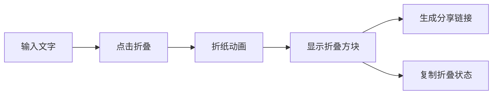
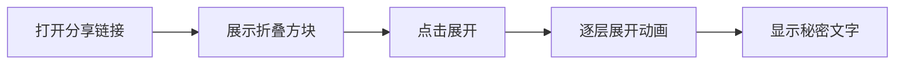

## 1. 产品概述

纸条折叠秘密信息是一个充满怀旧感的网页小工具，让用户可以将悄悄话写在虚拟便签纸上，通过逼真的折纸动画将文字隐藏在折叠的方块中。用户可以生成分享链接发送给朋友，对方打开后点击展开，纸条会一层层展开露出完整内容。

- **核心目标**：创造有趣、有仪式感的秘密信息传递体验
- **目标用户**：喜欢分享小秘密、怀念学生时代传纸条的年轻用户
- **产品价值**：用独特的折纸动画让简单的文字分享变得有趣且富有仪式感

## 2. 核心功能

### 2.1 功能模块

1. **便签输入区**：横条便签纸样式的文本输入框
2. **折叠动画**：多层纸张折叠动画，将长纸条折成小方块
3. **展开动画**：一层层展开方块，逐步露出文字内容
4. **分享功能**：生成包含加密内容的分享链接 / 复制折叠状态
5. **折叠状态展示**：折叠后的方块展示，可点击展开

### 2.2 页面详情

| 页面名称 | 模块名称 | 功能描述 |
|---------|---------|----------|
| 首页 | 便签输入区 | 米黄色横条便签纸，支持多行文字输入，实时显示文字 |
| 首页 | 操作按钮区 | 折叠按钮、分享按钮、复制按钮 |
| 首页 | 折叠展示区 | 折叠后的方块展示，带有折痕纹理，点击可展开 |
| 分享页 | 折叠方块 | 直接展示折叠状态的方块，提示用户点击展开 |
| 分享页 | 展开动画 | 点击后逐层展开动画，最终显示完整文字 |

## 3. 核心流程

### 3.1 发送方流程

用户在输入框输入悄悄话 → 点击折叠按钮 → 纸条依次对折成方块 → 显示折叠后的方块 → 点击分享/复制 → 获得分享链接或复制状态

### 3.2 接收方流程

打开分享链接 → 看到折叠的方块 → 点击展开 → 纸条逐层展开 → 显示完整文字内容

## 4. 用户界面设计

### 4.1 设计风格

- **设计方向**：怀旧学生风 + 纸张质感
- **主色调**：米黄色（便签纸）#FFF8E7、深褐色 #5D4E37、红色折痕点缀 #E57373
- **辅助色**：浅棕色 #D7CCC8、深灰色 #424242
- **字体**：手写风格字体（如 Ma Shan Zheng 或类似的中文手写体）搭配衬线字体
- **按钮风格**：圆润纸质按钮，带有轻微阴影和按压效果
- **整体氛围**：温暖、怀旧、有仪式感，像学生时代偷偷传纸条的感觉

### 4.2 页面设计概述

| 页面名称 | 模块名称 | UI 元素 |
|---------|---------|---------|
| 首页 | 便签输入区 | 米黄色长条纸张、横线纹理、手写字体输入、纸张阴影 |
| 首页 | 操作按钮 | 纸质质感按钮、折叠图标、分享图标、悬停微动效 |
| 首页 | 折叠方块 | 正方形方块、折痕线条、立体阴影、点击反馈 |
| 分享页 | 折叠方块 | 居中展示的方块、提示文字、脉冲动画吸引点击 |

### 4.3 折纸动画设计

- **折叠顺序**：从下往上对折 → 从左往右对折 → 再从下往上对折（形成小方块）
- **折痕效果**：折叠处有轻微的阴影加深和高光，模拟纸张厚度
- **动画节奏**：每次折叠有 0.4-0.6 秒的过渡，折叠之间有短暂停顿
- **展开动画**：与折叠顺序相反，逐层展开，每层展开后略微停顿
- **3D 效果**：使用 CSS 3D transform 模拟真实纸张折叠的透视效果

### 4.4 响应式设计

- **桌面端**：纸张横向展示，宽度适中，居中布局
- **移动端**：纸张自适应屏幕宽度，字体大小适配触屏操作
- **触摸优化**：按钮和方块有足够的点击区域（最小 44px）

