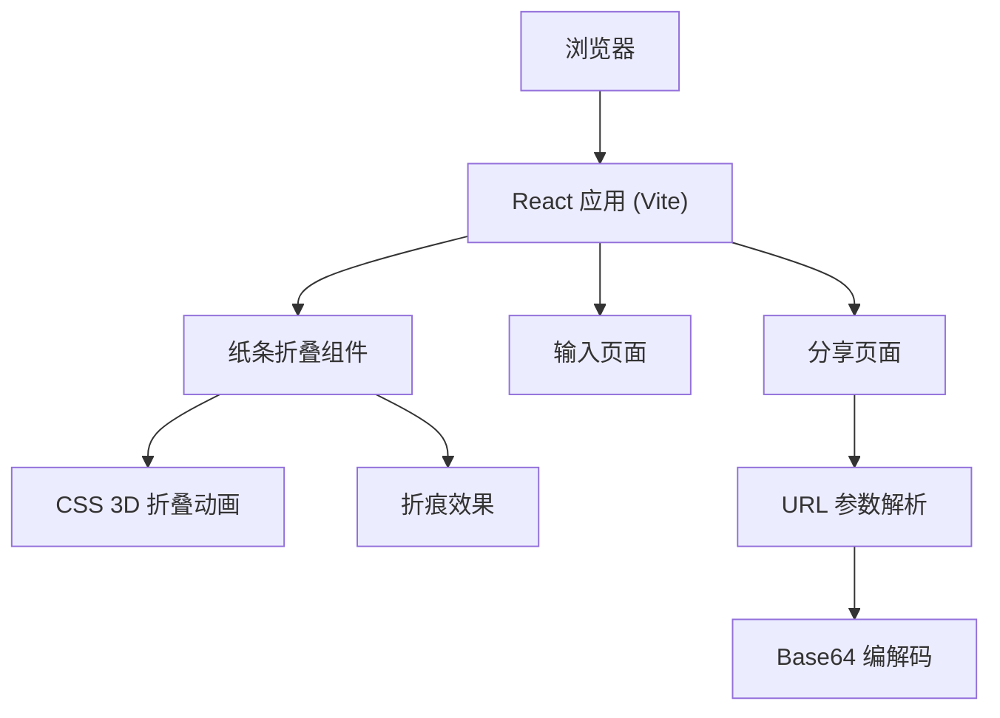

## 1. 架构设计

这是一个纯前端应用，使用 React + Vite + TailwindCSS 构建，无后端依赖。所有数据通过 URL 参数加密存储，实现分享功能。



## 2. 技术栈描述

- **前端框架**: React@18 + TypeScript
- **构建工具**: Vite@5
- **样式方案**: TailwindCSS@3
- **状态管理**: zustand
- **路由**: react-router-dom@6
- **图标**: lucide-react
- **动画**: 纯 CSS 3D transforms + transitions

## 3. 目录结构

```
src/
├── components/
│   ├── PaperStrip/
│   │   ├── PaperStrip.tsx      # 纸条组件（可折叠的纸条
│   │   └── PaperStrip.css     # 纸条样式和动画
│   ├── FoldedBlock/
│   │   └── FoldedBlock.tsx    # 折叠后的方块展示
│   └── ShareButtons/
│       └── ShareButtons.tsx       # 分享、复制按钮组件
├── pages/
│   ├── Home.tsx                # 首页 - 输入文字
│   └── Share.tsx               # 分享页 - 查看秘密
├── hooks/
│   └── usePaperFold.ts          # 折叠逻辑 hook
├── utils/
│   └── encode.ts               # 编码/解码工具
├── App.tsx
├── main.tsx
└── index.css
```

## 4. 路由定义

| 路由 | 页面 | 功能 |
|------|------|------|
| `/` | 首页 | 输入文字、折叠、生成分享链接 |
| `/s/:data` | 分享页 | 解析 URL 中的秘密信息，点击展开 |

## 5. 核心组件设计

### 5.1 纸条折叠组件 (PaperStrip)

**Props**:
- `text: string` - 纸条上的文字
- `foldState: number` - 折叠状态 0-3（0=展开, 1=第一次对折, 2=第二次对折, 3=完全折叠）
- `onFoldComplete?: () => void` - 折叠完成回调

**核心逻辑**:
- 使用 CSS `transform-style: preserve-3d` 实现 3D 折叠
- 将纸条分成多个面板，每个面板独立旋转
- 折痕处使用渐变阴影模拟纸张厚度

### 5.2 折叠状态管理

使用 zustand 管理折叠状态：

```typescript
interface PaperState {
  text: string;
  foldLevel: number; // 0-3
  isFolded: boolean;
  setText: (text: string) => void;
  fold: () => void;
  unfold: () => void;
  reset: () => void;
}
```

### 5.3 分享编码方案

使用 Base64 + URL 安全编码：
- 将文字内容编码为 Base64
- 替换 URL 不安全字符
- 将编码后的数据放到 URL 参数中
- 分享页读取 URL 参数并解码显示

## 6. 动画实现方案

### 6.1 折叠步骤

1. **初始状态**：长条形纸条，水平放置
2. **第一次折叠（下→上）**：底部 1/3 向上折叠
3. **第二次折叠（左→右）**：左侧 1/2 向右折叠
4. **第三次折叠（下→上）**：底部 1/2 向上折叠，形成方块

### 6.2 技术要点

- 使用 `transform: rotateX() / rotateY()` 实现折叠
- `transform-origin` 控制折叠轴位置
- `transition` 控制动画时长和缓动函数
- 折叠面板使用 `backface-visibility: hidden` 优化性能
- 折痕效果通过 `box-shadow` 和渐变模拟

## 7. 响应式方案

- 使用 TailwindCSS 响应式工具类
- 纸条宽度在移动端自适应屏幕宽度
- 字体大小使用 rem 单位自适应
- 触摸设备优化交互体验
